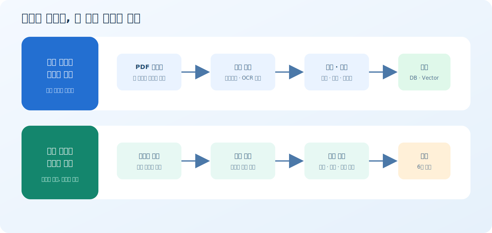
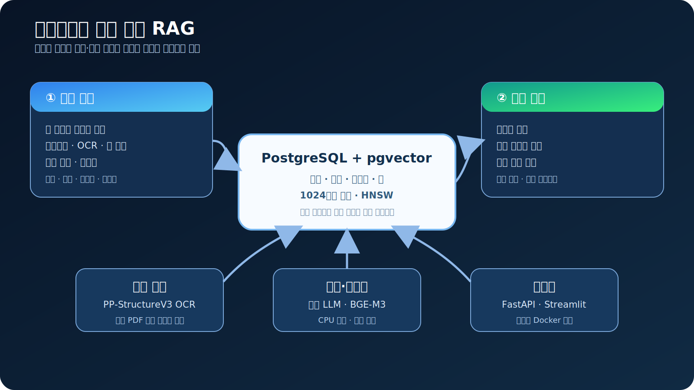
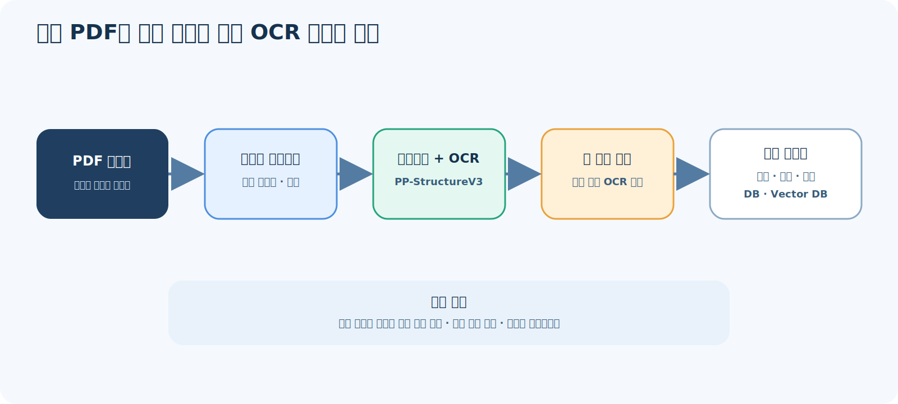

<!-- _class: lead center -->

# 온프레미스 논문 분석 RAG

### 비정형 PDF를 검수 가능한 지식과 엑셀로

`PDF 분석` · `본문 단락화` · `키워드 검색` · `pgvector`

---

# 문제

## 논문은 많지만 바로 검색할 수 없다

- PDF마다 구조와 품질이 다름
- 본문·표·참고문헌이 섞여 있음
- 추출 결과를 신뢰하기 어려움
- 필요한 단락을 다시 정리해야 함

> **목표: 추출 과정을 보여주고, 검색 결과를 바로 활용하게 한다.**

---

# 두 사용자 경험



---

# 전체 아키텍처



---

# 저장하는 정보

<div class="center">
  <span class="tag">제목 · 저자 · 연도</span>
  <span class="tag">본문 원문</span>
  <span class="tag">단락별 정제문</span>
  <span class="tag">단락별 요약</span>
  <span class="tag">키워드 3~5개</span>
  <span class="tag">표 원문 · 요약</span>
</div>

## 저장하지 않는 정보

<div class="center">
  <span class="tag">사진</span>
  <span class="tag">독립 수식</span>
  <span class="tag">참고문헌</span>
  <span class="tag">부록</span>
</div>

---

# 검색 원칙

## 정확한 키워드를 먼저 찾는다

```text
자연어 질의
   ↓
정확 키워드 · 별칭 매칭
   ↓ 실패
벡터 유사 키워드 제안
   ↓
대표 논문 + 연관 논문
```

**결과와 선정 이유는 화면에서, 상세 단락은 엑셀에서 확인**

---

# 결과물: 6시트 엑셀

| 구분 | 포함 정보 |
| --- | --- |
| 검색 결과 요약 | 키워드 · 방식 · 점수 · 선정 이유 |
| 대표/연관 논문 정보 | 제목 · 저자 · 연도 · 저널 |
| 대표/연관 논문 단락 | 원문 · 정제문 · 요약 · 키워드 |
| 표 데이터 | 표 제목 · 내용 · 요약 |

---

# CPU 중심 모델 라우팅



---

# 모델 선택

| 역할 | 기본 선택 | 이유 |
| --- | --- | --- |
| 전체 레이아웃 | PP-DocLayout-M | CPU 실동작 확인 |
| 한국어 OCR | PP-OCRv5 mobile | 한국어·영어·숫자 지원 |
| 표 영역 | 좌표 기반 OCR 정렬 | 복잡 셀 구조는 평가 후 도입 |
| 임베딩 | BGE-M3 | 한·영 교차 검색 · 1024차원 |
| 요약·키워드 | Qwen2.5-7B Q4 | 로컬 JSON 응답 확인 |

---

# 검증된 범위

<p class="big center">78 automated tests passed</p>

| 확인됨 | 아직 주장하지 않음 |
| --- | --- |
| 좌표·검수·검색·엑셀 코드 계약 | 실제 논문 OCR 정확도 |
| Paddle·BGE·LLM 실기동 · `/ready` | mAP·CER·TEDS 합격 |
| CC 논문 66편·1,175p·checksum | production 동시 처리 |

> `/ready`가 모델·DB·LLM 누락을 실패로 공개

---

# 현재와 목표

| 현재 | 다음 목표 |
| --- | --- |
| 대표 1 + 연관 1 | 대표 키워드 3~5개 품질 검증 |
| 검색 결과 안내 | 업종 관련 RAG 답변 |
| 합성 PDF 실모델 OCR 성공 | 실제 논문 품질 평가 |
| 현재 구성 `/ready` | 미달 영역만 모델 확대·파인튜닝 |

> **측정 없이 모델을 키우지 않는다.**

---

<!-- _class: lead center -->

# 기대 효과

### 추출은 투명하게 · 검색은 정확하게 · 결과는 바로 활용하게

**폐쇄망에서 동작하는 논문 분석 기반**
