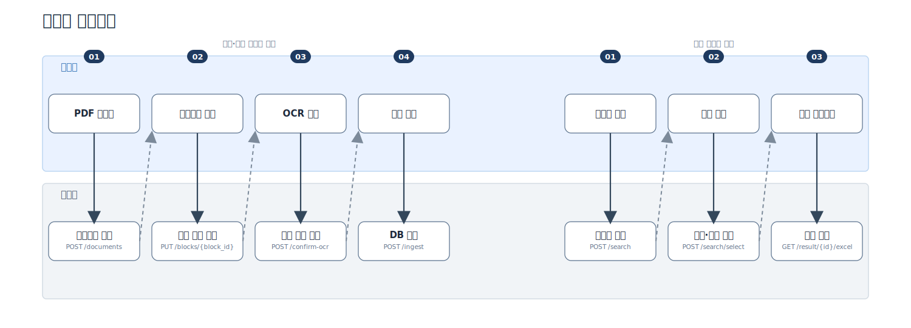
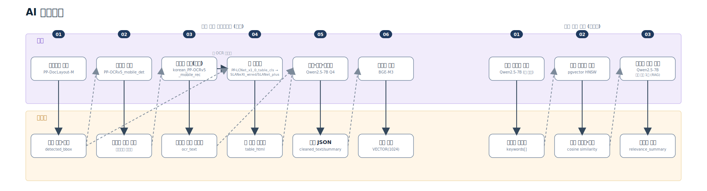
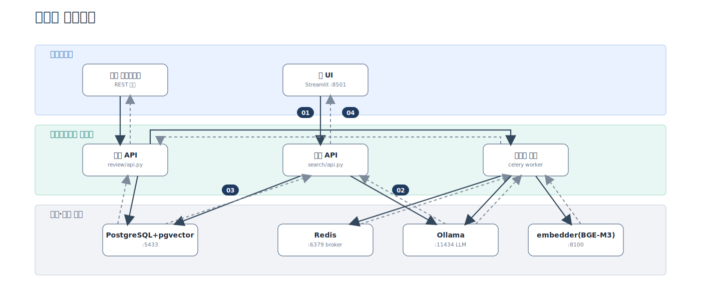

<!-- _class: lead center -->

# 온프레미스 논문 분석 RAG

### 비정형 PDF를 검수 가능한 지식과 엑셀로

`PDF 분석` · `본문 단락화` · `생성형 AI 근거 설명` · `pgvector` · `온프레미스`

---

<p class="kicker">1. 기획 개요 및 서론</p>

# 문제

## 논문은 많지만 바로 검색할 수 없다

- PDF마다 구조와 품질이 다름 · 본문·표·참고문헌이 섞여 있음
- 추출 결과를 신뢰하기 어려움 · 필요한 단락을 다시 정리해야 함

> **기획의도: 추출 과정을 투명하게 보여주고, 검색 결과에 "왜 이 논문인지" 근거까지 붙여 바로 활용하게 한다.**

---

# 서비스 소개 — 두 사용자 경험



---

# 대표기능

<div class="center">
  <span class="tag">전 페이지 OCR·레이아웃 분석</span>
  <span class="tag">검수 화면(박스·텍스트 직접 교정)</span>
  <span class="tag">정확 키워드 우선 검색</span>
  <span class="tag">벡터 유사 키워드 제안</span>
  <span class="tag">근거 단락 기반 관련도 설명(RAG)</span>
  <span class="tag">엑셀 산출물 자동 생성</span>
</div>

**등록자**는 분석 품질을 투명하게 확인·교정하고, **검색자**는 대표·연관 논문과
그 근거를 바로 확인해 산출물을 받는다.

---

<p class="kicker">2. 생성형 AI 핵심 기술</p>

# LLM·임베딩 모델 스펙

| 역할 | 모델 | 설정 |
| --- | --- | --- |
| 요약·키워드·질의해석·근거설명 | `qwen2.5:7b-instruct-q4_K_M` (Ollama) | `temperature=0.0`, `format=json` 강제, `num_predict=192`, `timeout=300s` |
| 임베딩 | `BAAI/bge-m3` (sentence-transformers) | 1024차원, CPU 추론 |
| 키워드 정규화 | Kiwi 형태소 분석 | 표기 변형 흡수(LLM 미사용) |

모든 LLM 호출은 JSON 스키마를 강제해 파싱 실패를 원천 차단하고, `temperature=0.0`으로
재현 가능한 결정적 출력을 우선한다. 동일 프롬프트+모델+설정 조합은 파일 캐시로 재계산을 건너뛴다.

---

# 페르소나 템플릿 설계

## 태스크마다 역할을 명시적으로 지정한다

```text
"너는 한국어/영어 논문을 정제하는 연구 보조자다."          (단락 정제·요약)
"너는 한국어 논문 편집자다."                              (JSON 시스템 규칙)
"너는 논문 검색 질의에서 핵심 명사구를 추출하는 연구 보조자다." (질의 키워드 추출)
"너는 왜 이 논문이 검색과 관련 있는지 설명하는 연구 보조자다." (RAG 관련도 설명)
```

**실패 시 페르소나를 더 강하게 재지시**한다(한자·중국어 혼입 감지 시):
`"Act as a native Korean academic editor. Write every Korean word in Hangul..."`

→ 태스크별로 역할을 좁게 고정해 모호한 지시보다 출력 일관성을 높인다.

---

# 최적화 프롬프트 구조

```text
[system] 반드시 유효한 JSON만 반환하라. 스키마: {"summary":...} + 페르소나 규칙
[user]   예시 입력/출력 2쌍 (few-shot) → 실제 입력 단락
```

- **입력에 없는 내용 추가 금지**를 모든 프롬프트에 명시(환각 억제)
- **언어 오염 검증**: 한자·중국어 문자 감지 시 강한 페르소나로 1회 재시도
- **실패 정책**: 재시도까지 실패하면 원문 그대로 통과(폴백) 또는 명시적 실패 — 조용히 저품질 결과를 섞지 않는다
- **캐시**: 프롬프트+모델+설정 해시 기준 파일 캐시로 동일 요청 재호출 방지

---

# 생성 단계 — 검색에 근거를 붙이다 (RAG)

```text
대표/연관 논문 확정 → 논문 안에서 질의와 가장 유사한 단락 1개 선택(근거 제한)
   → "왜 이 논문이 관련 있는지" 1~2문장 생성 (relevance_summary)
```

- 근거 단락에 없는 사실은 생성하지 않도록 프롬프트로 제한
- 같은 키워드로 이미 생성한 결과는 캐시 재사용(LLM 재호출 없음)
- 생성 실패 시 근거 단락 원문 앞부분으로 폴백(무응답 방지)

**단순 키워드 검색이 아니라, retrieval(근거 단락) + 근거 제한 generation이 결합된 구조다.**

---

<p class="kicker">3. 아키텍처 및 설계도</p>

# 데이터 파이프라인 흐름



---

# 전체 시스템 아키텍처



---

# 배포 다이어그램

| 항목 | 내용 |
| --- | --- |
| 배포 단위 | 단일 이미지(`paperrag:{git_sha}`)를 embedder/api/worker/ui 4개 서비스가 공유 |
| 트리거 | `main` 병합 → `ci.yml`→`deploy.yml` → 셀프호스트 러너(온프레미스) → `scripts/deploy.sh` |
| 배포 순서 | 이미지 빌드 → 앱 서비스만 정지 → DB 마이그레이션 → 재기동 → 헬스체크 → 실패 시 이전 SHA로 롤백 |
| 상시 서비스 | postgres·redis·ollama는 배포 중에도 중지하지 않음 |

완전 자동 CD — 사람 개입 없이 push만으로 빌드~헬스체크~롤백까지 수행한다.

---

# 온프레미스 정적 자산 배포 (CDN 대체 구성)

폐쇄망 단일 서버에서 동작해 **외부 CDN을 쓰지 않는다.** 정적 자산은 전부 로컬 볼륨/바인드
마운트로 서빙한다.

| 자산 | 위치 | 방식 |
| --- | --- | --- |
| Paddle 레이아웃/OCR/표 모델 (약 4.6GB) | `./models` | 호스트 바인드, 컨테이너 읽기 전용(ro) |
| Ollama LLM 가중치 | `ollama_models` 볼륨 | 컨테이너 재생성에도 보존 |
| 검수 원본 PDF·페이지 이미지 | `./data/review` | 호스트 바인드 마운트 |
| 검색 결과 엑셀 | `./outputs` | 호스트 바인드 마운트 |
| 폐쇄망 반입 | 이미지 tar + 모델 파일 번들(오프라인 전달) | 외부 네트워크 접근 불요 |

---

<p class="kicker">4. 오픈소스화</p>

# 채택한 오픈소스 기술

| 계층 | 오픈소스 | 라이선스 | 채택 근거 |
| --- | --- | --- | --- |
| 레이아웃·OCR·표구조 | PaddleOCR PP-StructureV3 | Apache 2.0 | 디지털·스캔 동일 경로, CPU 실행, 파인튜닝 공식 지원 |
| LLM | Qwen2.5-7B-Instruct (Ollama) | Apache 2.0 | 한국어 처리 양호, CPU 구동, JSON 강제 응답 |
| 임베딩 | BGE-M3 (sentence-transformers) | MIT/Apache | 한·영 교차 검색, 1024차원 |
| PDF 렌더링 | pypdfium2 / pypdf / pdfplumber | Apache-2.0 / BSD-3 | 텍스트 레이어는 참고용, 페이지 이미지화만 사용 |
| 저장소 | PostgreSQL + pgvector | PostgreSQL License | 정형·벡터 질의 단일 저장소 |
| 진단 비교용 | Docling | MIT | 운영 미사용, 장애 원인 비교 전용 |

---

# 라이선스 배제 기준

**상용 이용 가능한 라이선스만** 운영 경로에 채택한다(폐쇄망 상용 서비스 전제).

| 후보 | 배제 사유 |
| --- | --- |
| LayoutLMv3 / DiT | 가중치 CC BY-NC (비상업) |
| Surya / Marker | GPL + 가중치 상용 조건부 |
| MinerU / DocLayout-YOLO | AGPL-3.0 — 벤치마크·성능 백업 후보로만 사용 |
| PyMuPDF(초기 채택분) | AGPL-3.0 확인 후 2026-07-20 pypdfium2로 교체 |

> Apache-2.0/MIT/BSD 계열만 남긴다 — 이 프로젝트 자체의 공개 계획은 없으며, 여기서
> "오픈소스화"는 **채택한 오픈소스 기술의 활용**을 뜻한다.

---

<p class="kicker">5. 프로젝트 핵심 체크포인트</p>

# 체크포인트 1 — 형식 무관 안정적 추출

- 디지털/스캔 구분 없이 **전 페이지 이미지화 후 단일 경로**로 처리(텍스트 레이어 품질 편차로
  인한 결과 불일치 원천 차단)
- 평가셋 15편(영문 10+한글 5)을 단·표·수식·그림 비중이 겹치지 않도록 의도적으로 다양하게 선정
- `consistency-*` 회귀 픽스처로 반복 처리 시 블록 누락/중복 여부 확인
- 그림·독립 수식·참고문헌·부록은 명시적 필터링 규칙(`is_topic_relevant`)으로 저장 제외

🔶 레이아웃 mAP·CER·TEDS 정량 수치는 골든셋 라벨링 완료 후 측정 예정("측정 없이 튜닝 없다")

---

# 체크포인트 2 — 엑셀 매핑 규칙 + 반자동 툴

**매핑 규칙**: 검색 결과 요약·대표/연관 논문 정보·단락(원문/정제문/요약/키워드)·표 데이터를
고정된 시트 구조(최대 9시트)로 자동 조립(`search/excel.py`). 열 너비·헤더 고정도 규칙화.

**반자동 입력 툴**: 검수 뷰어(`review/viewer.py`)에서 블록 좌표·유형·OCR 텍스트를 직접
확인·교정, confidence 낮은 영역만 우선 검수하거나 전체 일괄 승인도 가능.

```text
자동 검출(레이아웃·OCR) → 사람 교정(검수 뷰어) → 확정본 DB 적재 → 엑셀 매핑
```

---

# 체크포인트 3 — 온프레미스 민감문서 설계

논문 원문·요약·키워드를 **외부 클라우드로 전송하지 않는다.**

| 구성요소 | 실행 위치 |
| --- | --- |
| 레이아웃·OCR·표구조 (Paddle) · 임베딩 (BGE-M3) | 로컬 CPU |
| LLM (Qwen2.5-7B) | 로컬 Ollama |
| 저장소 (PostgreSQL+pgvector) | 로컬 |

런타임에 외부 API 호출이 전혀 없는 구조(모델 파일은 사전 반입, §3 온프레미스 정적 자산 배포).
이 설계가 프로젝트의 존재 이유다 — "왜 온프레미스인가"의 답이 곧 시스템 전체 설계다.

---

<p class="kicker">6. 형상관리</p>

# 코드·이미지·DB 버전관리

| 대상 | 방식 |
| --- | --- |
| 코드 | Conventional Commits, 작업 단위별 커밋, 단독 개발 중 `main` 직접 커밋 |
| 배포 이미지 | git short SHA를 이미지 태그로 사용(`paperrag:{sha}`) — 배포 시점 코드-이미지 1:1 대응 |
| 롤백 | 헬스체크 실패 시 직전 성공 SHA로 즉시 재기동(재빌드 없이) |
| DB 스키마 | 번호순 마이그레이션(`0001_init.sql`~`0006_...sql`), 순차 적용·추적 |
| CI/CD 분리 | `ci.yml`(테스트 게이트, 클라우드) → `deploy.yml`(배포, 셀프호스트 러너) |

> 롤백은 **코드만** 되돌린다 — DB 마이그레이션은 자동 복원 안 됨. 파괴적 변경은 하위 호환으로 설계.

---

# 형상관리 남은 공백

| 항목 | 현재 상태 |
| --- | --- |
| 모델·프롬프트 버전 기록 | ❌ 미구현 — 어떤 결과가 어떤 프롬프트/모델 조합인지 DB에 안 남음 |
| 데이터 출처·라이선스·checksum | 🔶 부분 — 수집 시 checksum 확인, 통합 provenance 기록은 없음 |
| 비동기 작업 상태 재개 | 🔶 부분 — Celery 큐는 있으나 실패 단계 재개(idempotency) 미완 |

정직하게 공백으로 남겨둔다 — 재현성 확보를 위한 다음 우선순위 작업이다.

---

<p class="kicker">7. 실시간 솔루션 시연</p>

# 시연 시나리오 — 정상 흐름

1. PDF 업로드 → 레이아웃 자동 검출 → 검수 화면에서 박스·OCR 텍스트 확인
2. "영역별 OCR 실행" → 검수·승인 → DB 적재
3. 자연어 질의 → 키워드 추출(LLM) → 정확 매칭 또는 유사 키워드 선택
4. 대표·연관 논문 + **관련도 설명(RAG)** 확인 → 엑셀 다운로드

---

# 시연 시나리오 — 엣지케이스·예외 복구

실제 구현된 실패 대응을 라이브로 보여준다(리허설로 실패 화면을 감추지 않고 **의도적으로 재현**):

| 상황 | 시스템 반응 |
| --- | --- |
| 비동기 OCR 작업 실패 | 자동으로 **동기 경로로 폴백**해 처리를 이어감(커밋 `81a9bea`) |
| 동시 LLM/OCR 요청 과부하 | `HeavyTaskBusyError`(HTTP 503)로 "지금은 처리 중" 명시적 응답 |
| LLM이 한자·중국어를 섞어 응답 | 언어 오염 감지 → 강한 페르소나로 1회 자동 재시도 |
| LLM 응답이 끝내 신뢰 불가 | 저품질 결과를 감추지 않고 **명시적으로 실패** 처리 |

> 목표: "잘 되는 것만 보여주기"가 아니라 **실패를 어떻게 다루는지**를 보여준다.

---

<!-- _class: lead center -->

# 라이브 데모

### (여기서 화면 전환 — 실제 서버 시연)

`/documents/{id}/viewer` 검수 화면 → Streamlit 검색 UI → 엑셀 다운로드

---

<p class="kicker">8. 향후 발전 방향 및 소회</p>

# 현재와 목표 · 우선순위

| 현재 | 다음 목표 |
| --- | --- |
| 대표 1 + 연관 1 + 관련도 설명(단답 RAG) | 다중 문서 종합 대화형·업종 맞춤 답변 |
| 검증된 코드 계약 + 실기동(`/ready`) | 실제 논문 mAP·CER·TEDS 정량 측정 |
| 모델·프롬프트 버전 미기록 | provenance·버전 기록 추가 |

**우선순위**: ① 실제 논문 10편 수용 테스트 ② 50~100편 평가셋 mAP/CER/TEDS/recall 측정
③ 비동기 작업 실패 재개 완성 ④ 다중 문서 종합 답변 생성 ⑤ 기준 미달 영역만 파인튜닝(게이트 방식)

> **측정 없이 모델을 키우지 않는다.**

---

# 소회

> _(발표자 직접 작성 — 프로젝트를 진행하며 느낀 점, 어려웠던 점, 배운 점을
> 이 자리에 채워 넣는다. 코드나 문서에서 대신 채울 수 없는 부분이다.)_

---

<!-- _class: lead center -->

# 기대 효과

### 추출은 투명하게 · 검색은 근거와 함께 · 결과는 바로 활용하게

**폐쇄망에서 동작하는 논문 분석 기반**
