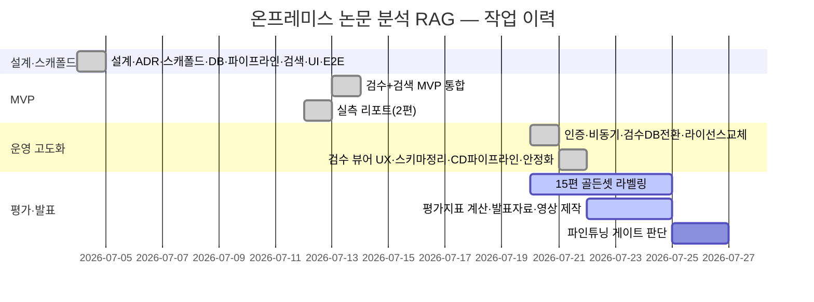

# WBS (Work Breakdown Structure) — 온프레미스 논문 분석 RAG

실제 커밋 이력(`git log`) 기준으로 작성한다. 날짜는 작업이 반영된 날짜이며, 상태는 2026-07-22 기준.

## 1. 작업분류체계 표

| WBS ID | 상위 작업 | 세부 작업 | 주요 산출물 | 기간 | 상태 |
| --- | --- | --- | --- | --- | --- |
| 1 | 기획·설계 | 통합 설계서 작성, ADR 2건(저장소·파싱 스택) | `DESIGN.md`, `adr/0001`, `adr/0002` | 2026-07-04 | 완료 |
| 2 | 인프라 스캐폴드 | pyproject(경량 코어+optional extras), docker-compose, Settings 모듈 | `pyproject.toml`, `docker-compose.yml` | 2026-07-04 | 완료 |
| 3 | DB 스키마 | 9테이블 마이그레이션, VECTOR(1024)·HNSW 3종 | `db/migrations/0001_init.sql` | 2026-07-04 | 완료 |
| 4 | 수집 파이프라인 | STEP 1~8 골격(검증·레이아웃·필터·단락·LLM정제·키워드·임베딩·연관도) | `src/paperrag/ingest/` | 2026-07-04 | 완료(오프라인 테스트) |
| 5 | 검색 서비스 | 정확매칭→유사제안→대표/연관 선정→엑셀(최대 9시트), FastAPI 3엔드포인트 | `src/paperrag/search/` | 2026-07-04 | 완료 |
| 6 | 웹 UI | Streamlit 검색 화면, API 클라이언트 | `src/paperrag/ui/` | 2026-07-04 | 완료 |
| 7 | E2E 검증 | 실 DB(pgvector) 통합 테스트 4건, 실 DB 버그 2건 수정 | `tests/integration/`, 요구사항 추적표 | 2026-07-04 | 완료 |
| 8 | MVP 통합 | 검수 화면+검색 MVP 통합 완성 | 커밋 `d68f133` | 2026-07-13 | 완료 |
| 9 | 실측 리포트 | 실제 논문 2편 OCR·RAG 실측, 저사양 CPU 자원 제약 확인 | `docs/reports/assessments/2026-07-12-two-paper-ocr-evaluation.md` | 2026-07-12 | 완료 |
| 10 | 운영 고도화 — 인증 | API 키 인증(헤더+쿼리) | `search/api.py`, `review/api.py` | 2026-07-20 | 완료 |
| 11 | 운영 고도화 — 비동기 처리 | OCR을 Celery 큐로 전환, `/jobs/{id}` 폴링, Redis 분산 세마포어 | `worker/`, `heavy_task_slot` | 2026-07-20 | 완료 |
| 12 | 운영 고도화 — 검수 저장소 DB 전환 | `FileReviewStore` → `PostgresReviewStore`, 백필 스크립트 | `review/store.py`, `review_documents` 테이블 | 2026-07-20 | 완료 |
| 13 | 라이선스 대응 | PyMuPDF(AGPL) → pypdfium2/pypdf/pdfplumber 교체 | 커밋 `d136871` | 2026-07-20 | 완료 |
| 14 | 평가셋 준비 | 한글 5편 언어 필터 추가, 15편 라벨링 대상 선정 및 가이드 작성 | `docs/guide/14-evaluation-labeling.md` | 2026-07-20 | 대상 선정 완료 / 라벨링 진행 중 |
| 15 | 검수 뷰어 UX | 검수 현황 요약, 단계 전환 버튼, 일괄 승인 버튼, 좌표 입력 개선 | `review/viewer.py` | 2026-07-21 | 완료 |
| 16 | 스키마 정리 | 죽은 컬럼 제거, 저널·링크 배선 | 커밋 `d423c01` | 2026-07-21 | 완료 |
| 17 | 배포 자동화 | GitHub Actions + 셀프호스트 러너 CD 파이프라인 | `.github/workflows/`, `scripts/deploy.sh` | 2026-07-21 | 완료 |
| 18 | 안정화 | 비동기 OCR 실패 시 동기 경로 폴백 | 커밋 `81a9bea` | 2026-07-21 | 완료 |
| 19 | 검색 RAG 고도화 | 질의 키워드 추출 항상 LLM 전환("AI 검색" 토글 제거), 대표·연관 논문 근거 단락 기반 관련도 설명 생성(`relevance_summary`) 추가, 실사용 서버 사양 분석 | `search/service.py`, `search/schemas.py`, `ui/app.py`, `docs/reports/assessments/2026-07-22-llm-search-capacity.md` | 2026-07-22 | 완료 |
| 20 | 평가·발표 준비 | 15편 골든셋 라벨링 완료, mAP/CER/TEDS 계산 로직 구현, 발표자료·영상 제작 | `docs/presentation/` | 2026-07-22~ | 진행 중 |
| 21 | 평가 게이트 판단 | 합격선 미달 항목만 파인튜닝 여부 결정 | DESIGN.md §6 | 예정 | 착수 전 |

## 2. 간트 요약 (마일스톤 기준)

## 3. 비고

- 단독 개발(1인) 프로젝트로 `main` 브랜치 직접 커밋 방식이었다(`CLAUDE.md` 협업 규칙 참고).
- 기계적 코드 작성 일부는 Codex CLI에 태스크 위임, 설계·검증·문서화는 직접 수행(`docs/dev-log/2026-07-04.md`).
- WBS ID 20~21은 이 발표 준비 자체가 포함된 진행 중/예정 작업이다.
