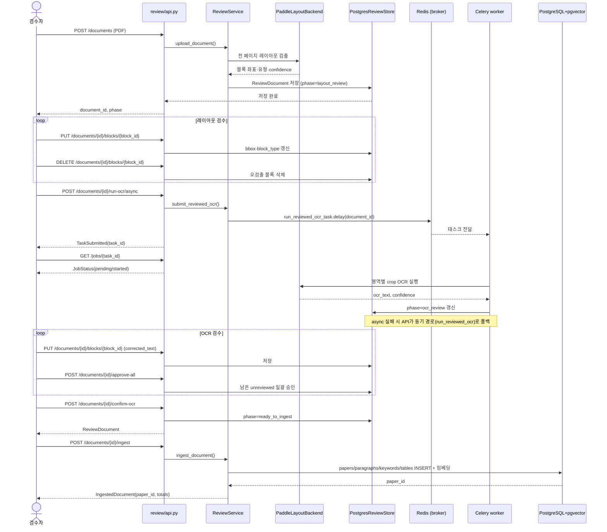
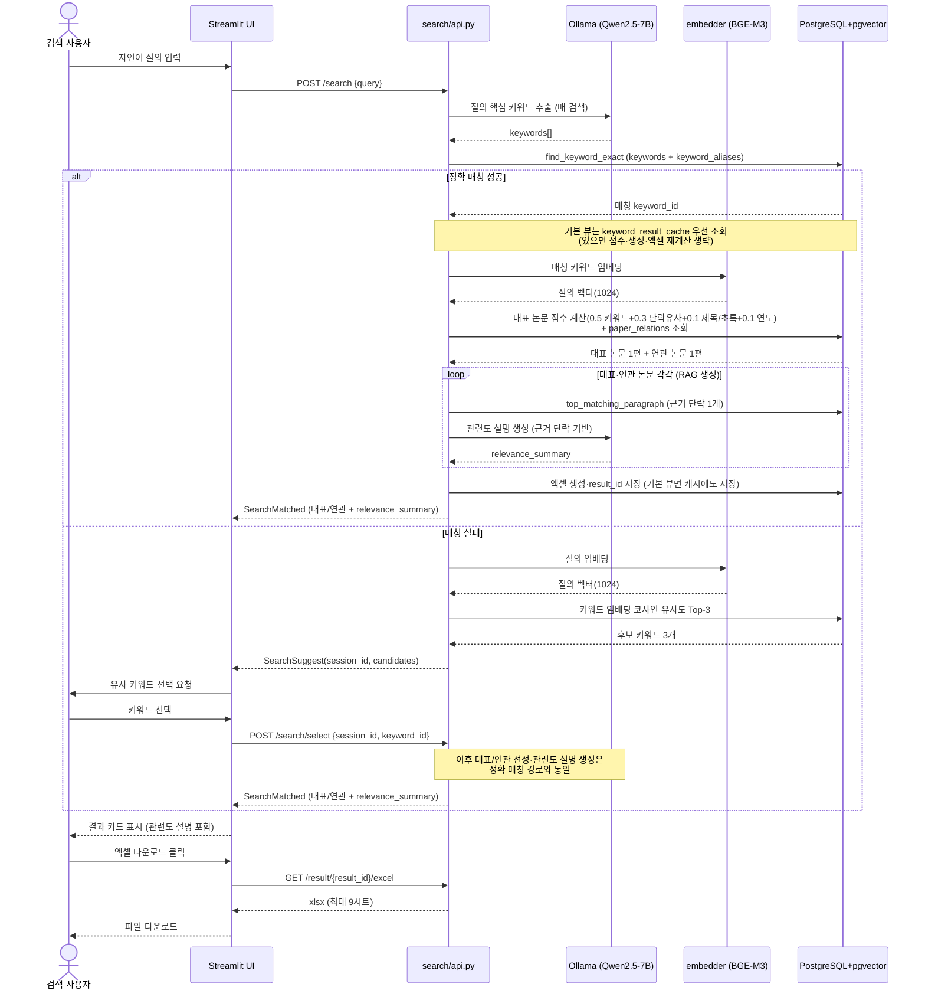

# 시퀀스 다이어그램 — 온프레미스 논문 분석 RAG

실제 라우트 함수명(`src/paperrag/review/api.py`, `src/paperrag/search/api.py`)과 Celery 태스크명
(`src/paperrag/worker/app.py`)을 그대로 사용한다.

## 1. 논문 등록·검수 흐름

## 2. 검색 흐름

질의 키워드 추출은 매 검색마다 항상 LLM(Qwen2.5-7B)으로 한다(형태소 분석은 LLM 실패 시의 내부
폴백일 뿐 사용자 선택 경로가 아니다). 대표/연관 논문이 정해지면 각 논문의 근거 단락 1개를 기반으로
"왜 이 논문이 질의와 관련 있는지" 짧은 설명을 LLM으로 생성한다(RAG 생성 단계, `relevance_summary`).

