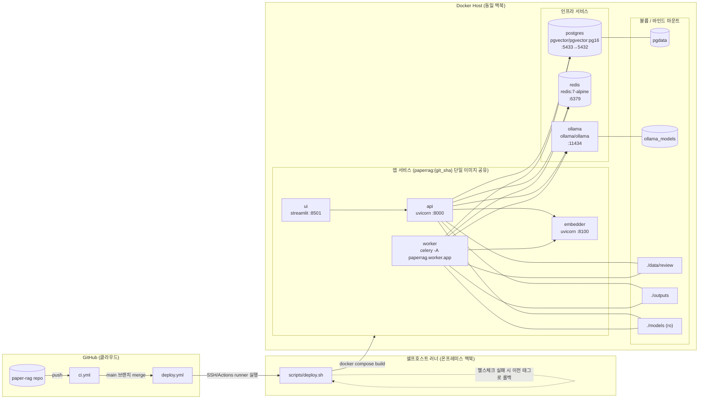

# 배치 다이어그램 — 온프레미스 논문 분석 RAG

실제 `docker-compose.yml`, `.github/workflows/deploy.yml`, `scripts/deploy.sh` 구성을 그대로 반영한다.
현재 배포 대상은 온프레미스 단일 서버(맥북) 1대이며, 별도 오케스트레이션(K8s 등) 없이
docker compose로 전 서비스를 기동한다.

## 배치 특징 요약

| 항목 | 내용 |
| --- | --- |
| 배포 단위 | 단일 Docker 이미지(`paperrag:${PAPERRAG_TAG}`, git short SHA 태그)를 embedder/api/worker/ui 4개 서비스가 공유 |
| 트리거 | `main` 브랜치 병합 → GitHub Actions `deploy.yml` → 셀프호스트 러너(온프레미스 맥북)에서 `deploy.sh` 실행 |
| 배포 순서 | 이미지 빌드(구버전 구동 중 진행) → 앱 서비스만 정지(`api worker ui embedder`) → DB 마이그레이션 적용 → 새 이미지로 재기동 → 헬스체크 → 실패 시 이전 SHA 태그로 롤백 |
| 상태 유지 서비스 | postgres·redis·ollama는 배포 중 중지하지 않음(마이그레이션이 postgres에 의존) |
| 영속 데이터 | `pgdata`(DB), `ollama_models`(LLM 가중치), `./data/review`(검수 원본 PDF·페이지 이미지), `./outputs`(엑셀), `./models`(Paddle 모델, 읽기 전용) — 전부 호스트 바인드/볼륨으로 컨테이너 재생성에도 보존 |
| 롤백 한계 | 이미지(코드)만 이전 태그로 되돌림 — 이미 적용된 DB 마이그레이션은 자동 되돌리지 않음(`scripts/deploy.sh` 주석 참고) |
| 폐쇄망 반입 경로 | 이미지 tar + 모델 파일 번들(`DESIGN.md` §2) — 현재 CD는 개발 환경 자동화이며 폐쇄망 반입은 별도 수동 절차 |
